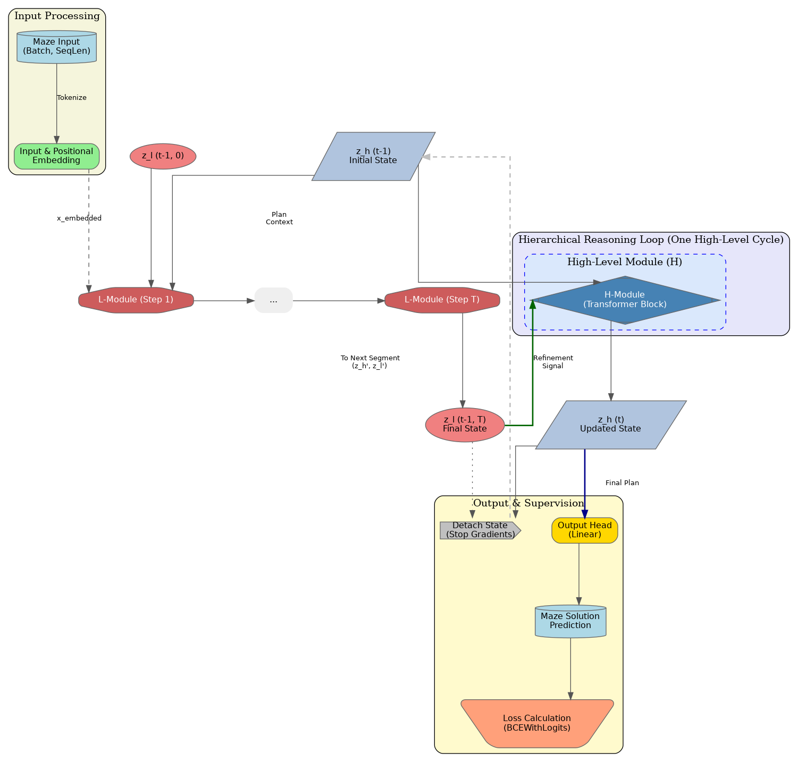
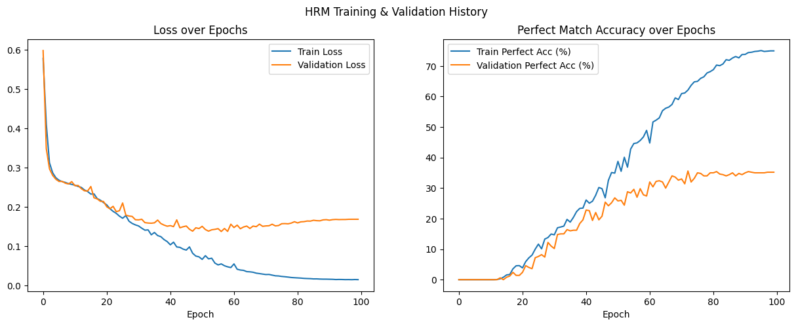

[](https://pytorch.org/)

# Hierarchical Reasoning Model (HRM) for Maze Solving
This is my implementation of the **Hierarchical Reasoning Model (HRM)**, a brain-inspired recurrent architecture, applied to the task of maze solving. The implementation is based on the concepts presented in the paper ["Hierarchical Reasoning Model" by Wang et al.](https://arxiv.org/pdf/2506.21734).

The goal of this project was to build a functional HRM and also find deep insights into its reasoning process through heatmaps

## Key Concepts
The HRM architecture is inspired by the hierarchical and multi-timescale processing observed in the human brain. It aims to achieve deep computational reasoning without sacrificing training stability or efficiency.

The core idea is to use two interdependent recurrent modules:
*   **High-Level (H) Module:** A "slow" recurrent network responsible for abstract planning and setting long-term goals. It maintains a stable, high-level strategy.
*   **Low-Level (L) Module:** A "fast" recurrent network that performs rapid, detailed computations to execute the sub-steps of the current plan provided by the H-module.

This temporal separation allows the model to perform iterative refinement: the H-module proposes a plan, the L-module explores it, and the result of this exploration is fed back to the H-module to refine the plan for the next cycle.



## Architecture Implementation

my implementation simplifies the model for clarity while retaining its core principles.

*   **Modules as Transformers:** Both the High-Level and Low-Level modules are implemented as standard `TransformerEncoder` blocks. They share the same dimensionality (`d_model`) but maintain separate weights.

*   **Recurrent Loop:** The model's `forward` pass explicitly implements the hierarchical loop:
    1.  An outer loop runs for `N` high-level cycles.
    2.  An inner loop runs for `T` low-level steps within each high-level cycle.
    3.  In the inner loop, the L-module updates its state `z_l` based on its previous state, the *current* (fixed) H-module state `z_h`, and the input maze embedding.
    4.  After the inner loop completes, the H-module performs a single update using its previous state and the final state of the L-module.

    ```python
    # Simplified logic from the forward pass
    for _ in range(N_CYCLES):
        for _ in range(T_STEPS):
            # Low-level module updates quickly
            z_l = self.l_module(z_l + z_h + x_embedded)
        # High-level module updates slowly using the final L-state
        z_h = self.h_module(z_h + z_l)
    ```

*   **Input and Output:**
    *   **Input Embedding:** The `11x11` maze is flattened into a sequence of 121 tokens. An `nn.Embedding` layer converts the token IDs (0 for path, 1 for wall) into dense vectors. A positional embedding is added to provide spatial awareness.
    *   **Output Head:** A final linear layer projects the `d_model`-dimensional representation of each of the 121 positions down to a single logit, which represents the model's confidence that the cell is part of the solution path.

## The "Thought Process": Visualizing Reasoning

A key feature of this repository is the ability to visualize the model's iterative reasoning. it generates a heatmap GIF that shows the model's confidence (`sigmoid` of the output logits) for each cell at every step of the computation.

(the results are not perfect, its confidence only stay through more than half the pathway. scaling up the 
maze size from 3x3..to 11x11 could be a good idea, but nonetheless its a good start for me)
<div align="center">


</div> 


*   **Early Steps:** The heatmap is often diffuse, representing uncertainty and the exploration of multiple potential paths.
*   **Later Steps:** As the H-module refines its plan, the confidence sharpens and concentrates along the correct path, while incorrect branches fade away. This visualization provides a intuitive way of understanding how the model "thinks" and converges on a solution.

## Training Framework
To ensure the results are reliable and the model doesn't overfit, I used a simple training framework.

*   **Deep Supervision:** As described in the paper, I train the model using a technique that avoids full Backpropagation Through Time (BPTT). After each full forward pass (a "segment"), I calculate the loss, perform a backward pass, and then **detach the hidden states** before feeding them into the next segment. This provides a stable and memory-efficient training signal.

*   **Train/Validation Split:** The dataset is split into training (80%) and validation (20%) sets. The model is evaluated on the unseen validation set after each epoch to get an unbiased measure of its generalization ability.

*   **Overfitting Prevention:**
    *   **Weight Decay (L2 Regularization):** Added to the `AdamW` optimizer to penalize large model weights.
    *   **Learning Rate Scheduling:** I use a linear warmup for the first 10 epochs followed by a cosine decay schedule. This stabilizes initial training and helps fine-tune the model later on.

*   **Model Checkpointing:** The script automatically saves the model weights whenever it achieves a new best accuracy on the **validation set**. This ensures that the final model we use for analysis is the one that generalizes best, not necessarily the one from the final, potentially overfitted, epoch.

## Results and Analysis

After training for 100 epochs, the model demonstrates a classic learning pattern.

<div align="center">



</div>

*   **Loss:** The training loss steadily decreases, while the validation loss decreases and then plateaus around epoch 50. This divergence is a clear sign of overfitting.
*   **Accuracy:** Similarly, the validation accuracy peaks around 35-40% and then flatlines, while the training accuracy continues to climb.

This result indicates that the model has learned the task to the best of its ability given the dataset size. The checkpointing system ensures we save the model from its peak performance (~35.6% in our run) before it started to overfit.

## How to Run

1.  **Clone the repository:**
    ```bash
    git clone https://github.com/hemantsingh443/HRM.git
    cd HRM
    ```
2.  **Open the Notebook:** Open the `HRM.ipynb` notebook in Google Colab or a local Jupyter environment.
3. Run the cell, everything is contained in one cell, from data creation to training

## Dependencies

The code is written in Python 3.12 and uses PyTorch. All dependencies can be installed via pip.
```bash
pip install torch numpy matplotlib imageio tqdm
``` 
## acknowledgments 

I would like to thank the authors of the paper for their work on this architecture. 
